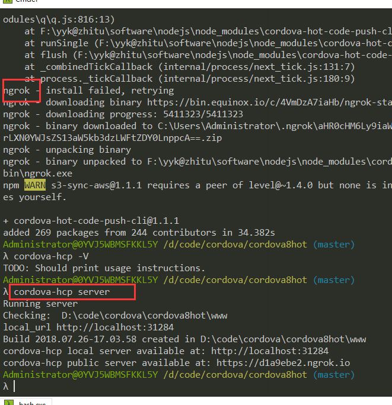
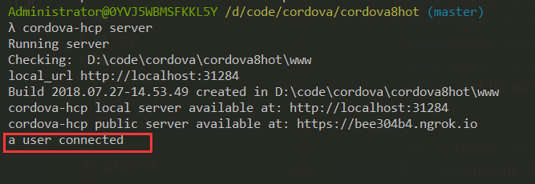
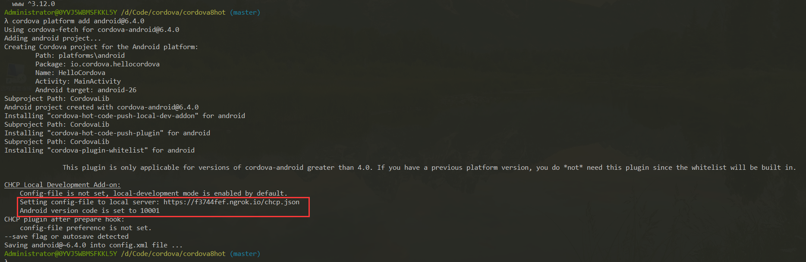
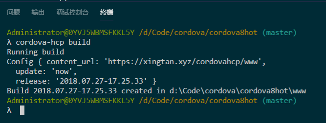
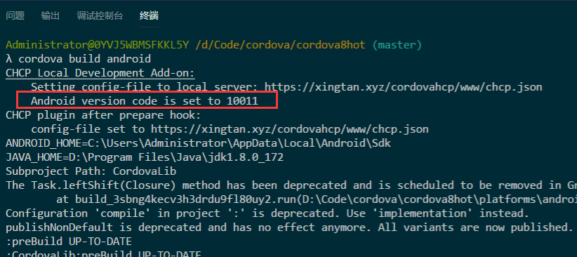
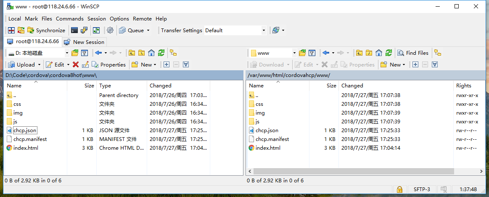

# cordova8

> 在cordova8(cordova create && cordova platform add android)的基础上 
> 把android版本update到6.4 
> 安装了cordova code hot push插件 
> 测试成功

https://blog.csdn.net/u010730897/article/details/53084254 
cordova-hot-code-push-plugin使用流程

https://blog.csdn.net/qq_29287973/article/details/53306411 
ionic 热更新插件cordova-hot-code-push的实践

注意 项目目录下的 .chcpenv 文件的内容 
从 开发模式下自动生成的 ngrok.io 的地址改为自己的地址

https://blog.csdn.net/mate_ge/article/details/78490940

https://github.com/nordnet/cordova-hot-code-push-cli

https://github.com/nordnet/cordova-hot-code-push-local-dev-addon 
注意如果成功的话cordova run会有 Android version code is set to 5

https://github.com/nordnet/cordova-hot-code-push

https://github.com/nordnet/cordova-hot-code-push/issues/336

android_版本从_7_降到 6.4_可以看到_android_version_set_to_10001

### 日常开发流程

`cordova-hcp build`

再开一个cmd窗口

`cordova build android`

> 这个只需要执行一次，因为cordova项目下已经配置好了所有插件(camera, file, file-transfer没用到用的formdata, cordova-hcp)，
> 以后只需要更新www目录下的静态文件，就是把vuejs工程打包好的dist目录下复制过来即可，
> 给index.html加上cordova.js的script，然后执行一下cordova-hcp build，然后把www目录上传到远程服务器。

把 www 目录全部复制到 https://xingtan.xyz/cordovahcp/www 下

把 apk 发送到真机上安装
也可 `cordova run` 在模拟器上测试
打开app

然后修改代码 www/index.html
重新 `cordova-hcp build`
上传

---

#### 项目介绍

cordova create app
cd app\
cordova platform add android

λ cordova -v
8.0.0

#### 软件架构
软件架构说明

#### 安装教程

1. xxxx
2. xxxx
3. xxxx

#### 使用说明

1. xxxx
2. xxxx
3. xxxx

#### 参与贡献

1. Fork 本项目
2. 新建 Feat_xxx 分支
3. 提交代码
4. 新建 Pull Request

#### 码云特技

1. 使用 Readme\_XXX.md 来支持不同的语言，例如 Readme\_en.md, Readme\_zh.md
2. 码云官方博客 [blog.gitee.com](https://blog.gitee.com)
3. 你可以 [https://gitee.com/explore](https://gitee.com/explore) 这个地址来了解码云上的优秀开源项目
4. [GVP](https://gitee.com/gvp) 全称是码云最有价值开源项目，是码云综合评定出的优秀开源项目
5. 码云官方提供的使用手册 [http://git.mydoc.io/](http://git.mydoc.io/)
6. 码云封面人物是一档用来展示码云会员风采的栏目 [https://gitee.com/gitee-stars/](https://gitee.com/gitee-stars/)
